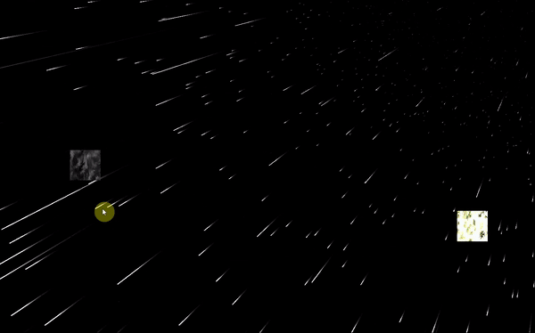

# MesmerizingCubes: An Endless Runner Game Project
## Introduction
I started this project as a way for me to learn (1) Unity, (2) Some game mechanics and logic, and (3) Shader programming. 

## The Game
You may click [here](https://dlaesker.github.io/MesmerizingCubesEndlessRunner/index.html) to play the game. Use the up and down arrows, well, to move up and down, respectively, and spacebar for "warp speed!" You, the player (a cube), are to avoid the incoming obstacles (also cubes).

The first thing you may notice is that the entities in the game are squares rather than cubes. Well, I am of the opinion that "Mesmerizing Cubes" sounds better than "... Squares." In any case, the "endless" mechanic was achieved by moving moving the player, camera, and background by the same speed as the game moves forward. This means that these three objects are generated only once during the game. It is their positions, however, that get updated. The obstacles are generated some distance away from the field of view of the player and, if no accidents take place, are destroyed once they leave the field of view again. The animations are actually shaders written in HLSL with the help of the Unity library. The "starfield" serves as the background and the player and obstacle materials were produced using a combination of Fractal Brownian Motion and Perlin Noise until I achieved a pattern I was happy with. The pattern on the player is static, but the one on any obstacle changes with time and in color. 

## TO-DO
### Improvements
The obstacle-generation paradigm could obviously benefit from an improvement. Creating and destroying objects is too expensive and unnecsessary. Instead, a pre-determined number of objects can be kept in an array and repurposed throughout the game. 

### ADD-ONS
* Score system
* Level system
* Better obstacle-positioning
* More shaders! 

